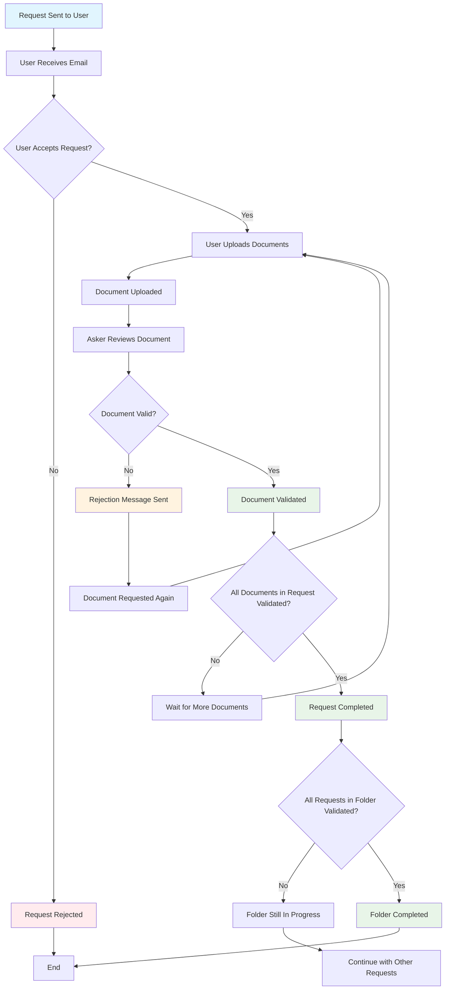

# Document Request Workflow

This document describes the complete workflow for document requests in the Documo application.

## Workflow Diagram

## Workflow States

### Request States

- **PENDING** 🟡: Initial state when request is sent
- **ACCEPTED** 🔵: User has accepted and is uploading documents
- **COMPLETED** 🟢: All documents validated and request finished
- **REJECTED** 🔴: User declined or request expired

### Document States

- **UPLOADED** 📄: Document uploaded, awaiting validation
- **VALIDATED** ✅: Document approved by asker
- **INVALIDATED** ❌: Document rejected, needs resubmission
- **ERROR** ⚠️: Technical error during upload/processing

### Folder States

- **IN_PROGRESS** 🔄: Some requests still pending/incomplete
- **COMPLETED** ✅: All requests in folder completed
- **ARCHIVED** 📦: Folder archived after completion

## Detailed Process

### 1. Request Initiation

- Asker creates a document request for specific user email
- System generates secure share link
- Email notification sent to user with request details

### 2. User Response

- User clicks email link to access request
- Can accept or reject the request
- If accepted, presented with document upload interface

### 3. Document Upload Process

- User uploads required documents one by one
- Each document is encrypted and stored securely
- Upload progress tracked in real-time

### 4. Validation Workflow

- Asker receives notification of new document upload
- Reviews document for completeness and accuracy
- Can approve, reject, or request modifications

### 5. Rejection & Resubmission

- If document rejected, user receives detailed feedback
- User can reupload corrected document
- Process repeats until document approved

### 6. Request Completion

- Request marked complete when all documents validated
- User and asker receive completion notifications
- Documents remain accessible for future reference

### 7. Folder Completion

- Folder completed when all constituent requests done
- Final summary and archive process initiated
- All stakeholders notified of completion

## Technical Implementation

### Key Components

- **Document Requests**: Core entity managing user document collection
- **Share Links**: Secure token-based access for external users
- **Document Storage**: Encrypted file storage with metadata
- **Validation System**: Approval/rejection workflow with feedback
- **Notification System**: Email alerts for status changes

### Security Features

- Token-based authentication for external access
- Document encryption at rest
- Audit trail for all actions
- Secure file upload with validation

### Performance Considerations

- Async processing for large file uploads
- Pagination for document lists
- Caching for frequently accessed data
- Optimized database queries for status checks

## Business Rules

### Timing

- Requests expire after configurable period (default: 30 days)
- Users can upload documents until request expires
- Validation must occur within reasonable timeframe

### Permissions

- Only request asker can validate documents
- Users can only access their specific requests
- Admins have oversight of all requests

### Data Retention

- Documents retained for audit purposes
- Completed folders archived after retention period
- Personal data handled per GDPR requirements

## Error Handling

### Common Scenarios

- Network interruptions during upload
- Invalid file formats
- Storage quota exceeded
- Email delivery failures

### Recovery Mechanisms

- Resume interrupted uploads
- Retry failed operations
- Fallback notification methods
- Manual intervention workflows

## Monitoring & Analytics

### Key Metrics

- Request completion rates
- Average time to completion
- Document rejection rates
- User engagement metrics

### Alerting

- Failed uploads or validations
- Expired requests
- System errors
- Performance degradation

This workflow ensures efficient document collection while maintaining security, compliance, and user experience standards.
