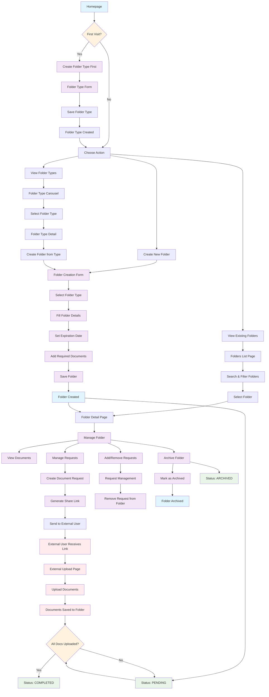

# Folder Workflow - Visual Diagram

## Folder Workflow Explanation

### 1. **Initial Setup**
- New users must create folder types before creating folders
- Folder types define the structure and required documents

### 2. **Folder Type Management**
- **Create Folder Type**: Define name, description, and required documents
- **View Folder Types**: Browse existing types in carousel format
- **Select Type**: Choose a type to create folders from

### 3. **Folder Creation**
- **Select Folder Type**: Choose from existing types
- **Fill Details**: Name, description, and metadata
- **Set Expiration**: Optional expiration date
- **Define Documents**: Required document types
- **Save**: Create the folder with PENDING status

### 4. **Folder Management**
- **View All Folders**: List page with search and filters
- **Folder Detail**: Individual folder management page
- **Status Management**: Track folder completion status
- **Archive**: Soft delete folders when no longer needed

### 5. **Document Request Integration**
- **Create Requests**: Generate document requests for external users
- **Share Links**: Generate secure links for document upload
- **Request Management**: Add/remove requests from folders
- **External Upload**: External users upload documents via shared links

### 6. **Status Workflow**
- **PENDING**: Initial state, waiting for documents
- **COMPLETED**: All required documents uploaded
- **ARCHIVED**: Folder marked as archived (soft deleted)

### 7. **Key Features**
- **Append-only**: Folders are never hard deleted, only archived
- **Status Calculation**: Dynamic status based on document completion
- **Type-based**: Folders inherit structure from folder types
- **External Integration**: Seamless connection with document requests
- **Search & Filter**: Advanced filtering by status and search terms

### 8. **User Experience Flow**
1. User creates folder types (templates)
2. User creates folders based on types
3. User generates document requests
4. External users upload documents
5. Folder status updates automatically
6. User manages and archives completed folders